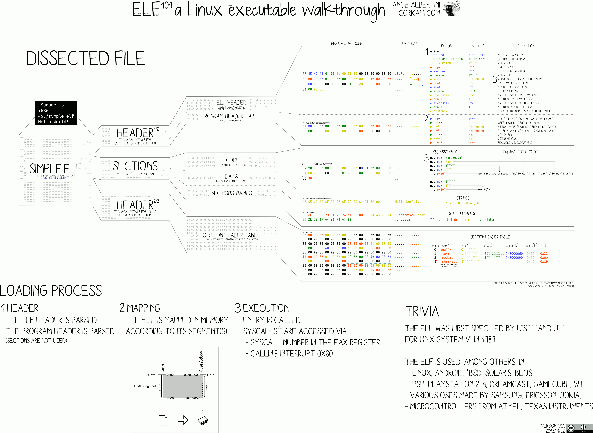

# ELF & Binary Tools

Two low-level utilities centered on the ELF format and binary editing, plus reference diagrams of the ELF layout.



## `task1.c` — `hexeditplus`
An interactive hex editor that operates on files and an in-memory buffer:
- set the working file name and the **unit size** (1, 2, or 4 bytes),
- **load** a region of a file into memory (`open`/`lseek`/`read`),
- **display** memory in hexadecimal or decimal,
- **modify** bytes in memory, and **save** a region back to the file (`write` at an arbitrary offset),
- a debug mode that traces the current state.

It uses a function-pointer menu and the raw POSIX file syscalls — the kind of tool you'd use to inspect or patch a binary by hand.

## `task4.c` — patch target
A small "count the digits in a string" program used as a **gdb binary-patching** exercise — compiled with `-fno-pie -fno-stack-protector` so its machine code can be examined and patched directly in the executable.

## Build & run
```bash
make                       # builds ./task1 and ./task4
./task1                    # hexeditplus menu
./task4 "abc123"           # prints 3
```
`test.bin` is a small sample you can load into the hex editor.

## Concepts
ELF file layout (see the included diagrams), raw file syscalls (`open`/`lseek`/`read`/`write`), unit-size-aware memory display, and binary inspection/patching with gdb.
