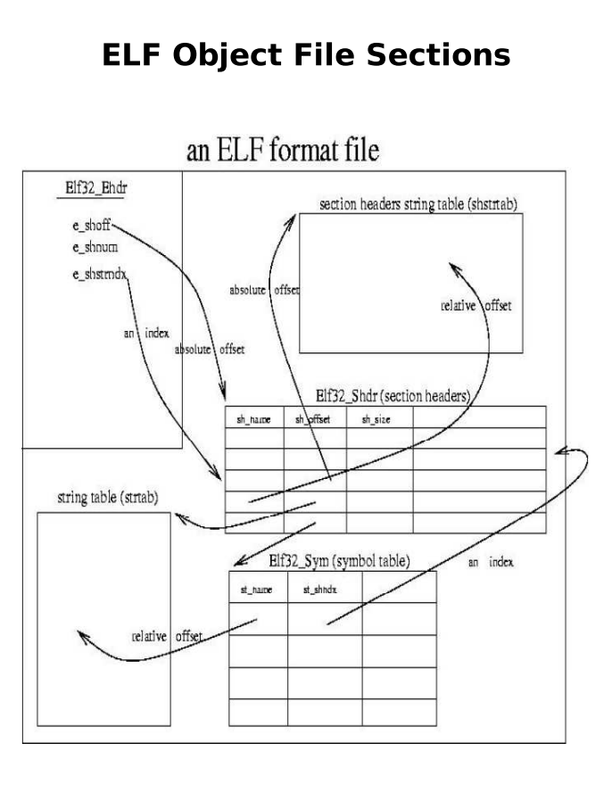

# ELF Manipulation Suite

Low-level utilities for inspecting and editing binaries at the byte level, with annotated diagrams of the ELF format.




## `hexeditplus` — interactive hex editor
A binary editor that operates on files and an in-memory buffer using only raw POSIX syscalls:
- set the working file and the **unit size** (1, 2, or 4 bytes),
- **load** a region of a file into memory (`open`/`lseek`/`read`),
- **display** memory in hexadecimal or decimal,
- **modify** bytes in memory and **save** a region back to the file at an arbitrary offset (`write`),
- a debug mode that traces the current state.

It is driven by a function-pointer menu — the kind of tool you'd reach for to inspect or patch a binary by hand.

## `digit_counter` — binary-patching target
A small "count the digits in a string" program, compiled with `-fno-pie -fno-stack-protector` so its machine code can be examined and **patched directly in the executable with gdb** (an exercise in reading and rewriting compiled code).

## Build & run
```bash
make                           # builds ./hexeditplus and ./digit_counter
./hexeditplus                  # interactive menu (try loading the bundled test.bin)
./digit_counter "abc123"       # prints 3
```

## Concepts
ELF file layout (see diagrams above), raw file syscalls (`open`/`lseek`/`read`/`write`), unit-size-aware memory display, and binary inspection/patching with gdb.
